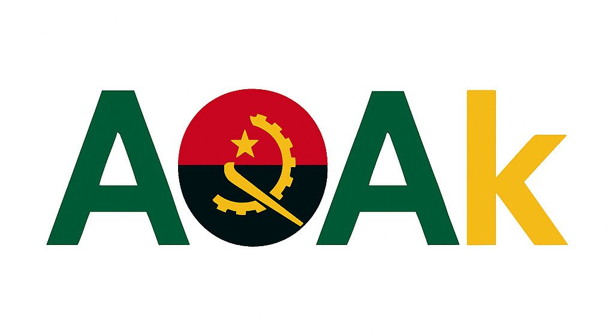

# 🇦🇴 Angola Digital Kwanza (AOAk) — Blockchain Stablecoin

---

## Overview
The Angolan Kwanza (AOA) has faced significant challenges due to high inflation, currency volatility, and dependence on oil revenues.  

Angola Digital Kwanza (AOAk) is a blockchain-native stablecoin pegged 1:1 to the Angolan Kwanza (AOA) and backed 100% by verified USD reserves held in a secure offshore custodian bank, offering a complementary digital stablecoin infrastructure that is fully collateralized and transparent, giving both local and international users a safe, transparent, and efficient means of transacting in a Kwanza-backed digital form.

AOAk provides a transparent, secure, and programmable digital currency that addresses Angola’s need for a modern financial instrument, bridging local users with the global financial system.

- **Ticker:** AOAK  
- **Name:** Angola Digital Kwanza (AOAk)  
- **Chain:** BNB Smart Chain (BSC)  
- **Standard:** ERC20 (Upgradeable, migration-ready to ERC-3643)  
- **Backed By:** 100% on-ledger verified USD reserves  

---

## 🔗 Mainnet Deployment

AOAk is now **live and verified** on the **Binance Smart Chain (BSC) Mainnet**.

| Network | Contract Type | Address | Explorer |
|----------|----------------|----------|-----------|
| **BSC Mainnet** | **Proxy (Main)** | [0xFcB51D954FC49b437Bf7329998D924CBa848b595](https://bscscan.com/address/0xFcB51D954FC49b437Bf7329998D924CBa848b595#code) | ✅ Verified |
| **BSC Mainnet** | Implementation | [0xeDa958fDBA6b56fEe9d2dD6EEF02c9D8B49445E2](https://bscscan.com/address/0xeDa958fDBA6b56fEe9d2dD6EEF02c9D8B49445E2#code) | ✅ Verified |

> 💡 The **Proxy Address** should be used for all live on-chain interactions, as it points to the verified, upgradeable implementation.

---

## 🧠 Key Details

- **Ticker:** AOAK  
- **Name:** Angola Digital Kwanza (AOAk)  
- **Chain:** Binance Smart Chain (BSC)  
- **Standard:** ERC-20 (Upgradeable; migration-ready to ERC-3643)  
- **Peg:** 1 AOAk = 1 AOA  
- **Reserve Backing:** 100% USD reserves held with a regulated offshore custodian  
- **Status:** ✅ Live and Verified on BSC Mainnet  

---

## 🎯 Mission & Necessity

The Angolan Kwanza (AOA) faces ongoing challenges from **inflation, volatility, and limited convertibility**. AOAk provides a **digitally accessible, reserve-backed** alternative that strengthens financial confidence and inclusion.

### Benefits for Angola:
- 💱 **Stability** — Reduces volatility by maintaining a 1:1 peg to the AOA.  
- ⚡ **Efficiency** — Enables real-time payments, remittances, and e-commerce integration.  
- 🪙 **Transparency** — On-chain verifiability and third-party reserve audits.  
- 🌍 **Global Accessibility** — Bridges Angola’s local economy with digital markets worldwide.  
- 👥 **Inclusion** — Expands access to digital finance for underbanked communities.

For a deeper economic and policy context, see [ANGOLA_ANALYSIS.md](docs/ANGOLA_ANALYSIS.md).

---

## 🧩 Repository Structure

| Directory | Description |
|------------|-------------|
| `contracts/` | Core AOAk smart contracts (Upgradeable ERC-20) |
| `docs/` | Whitepapers, country analysis, and economic reports |
| `branding/` | Logos and marketing assets |
| `AUDIT.md` | Independent audit documentation |
| `SECURITY.md` | Security policy and responsible disclosure |
| `CONTRIBUTION.md` | Developer contribution guidelines |

---

## 🛠️ Features

- 🔒 **Secure & Upgradeable** — Built with OpenZeppelin upgradeable contracts.  
- 💰 **USD-Backed Reserves** — Fully collateralized by U.S. dollars.  
- 🌐 **Global Interoperability** — Compatible with wallets, DeFi protocols, and exchanges.  
- 📊 **Transparent Ledger** — Real-time on-chain visibility.  
- 🧾 **Compliance-Ready** — Designed for future ERC-3643 (regulated token) migration.  

---

## 📄 Documentation

- [AOAk.sol.md](contracts/AOAk.sol.md) — Smart contract implementation  
- [WHITEPAPER](docs/WHITEPAPER.md) — Vision, tokenomics, and architecture  
- [ANGOLA_ANALYSIS.md](docs/ANGOLA_ANALYSIS.md) — Economic necessity report  
- [AUDIT.md](AUDIT.md) — Smart contract audit summary  
- [CONTRIBUTION.md](CONTRIBUTION.md) — Developer contribution process  
- [SECURITY.md](SECURITY.md) — Security policy and vulnerability reporting  

---

## ⚖️ Disclaimer

AOAk is **not licensed, endorsed, or sanctioned** by the **Banco Nacional de Angola (BNA)** or any Angolan government entity.  

It is developed and maintained independently by **Abba Payments Ltd.**, a British Virgin Islands–registered fintech company, founded by **Simon Kapenda**.

All code is open-sourced under the **MIT License**, and documentation is licensed under **CC BY 4.0**.

---

## 📬 Contact

- **Website:** [https://aoak.io](https://aoak.io)  
- **GitHub:** [https://github.com/abba-platforms/AOAk](https://github.com/abba-platforms/AOAk)  
- **Email:** partners@abbapp.com  
- **Organization:** [Abba Payments Ltd.](https://abbapp.com)  

---

## 🪙 License

This project is licensed under the **MIT License** – see [LICENSE.md](LICENSE.md) for details.  
Documentation is released under **Creative Commons CC-BY 4.0**.
